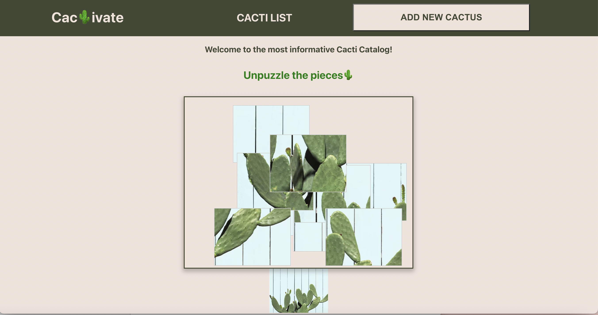
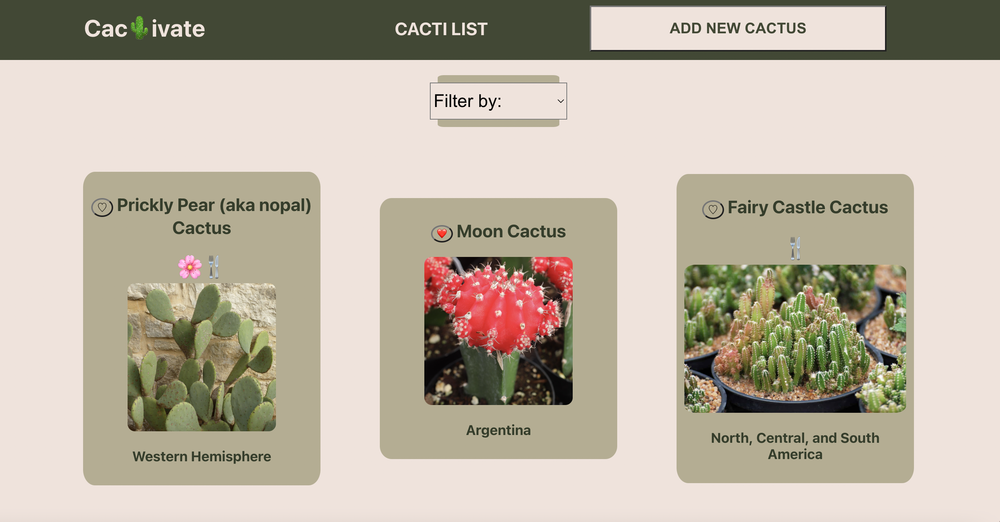
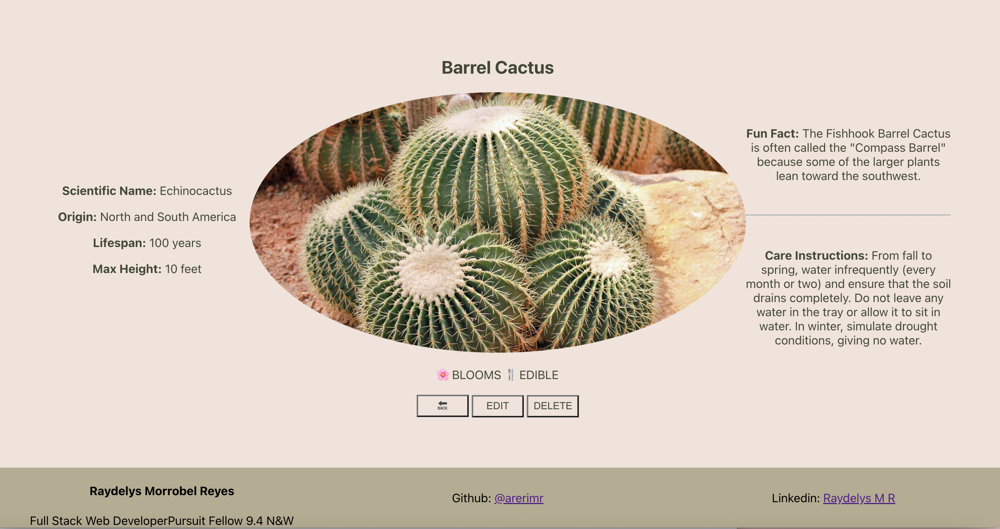
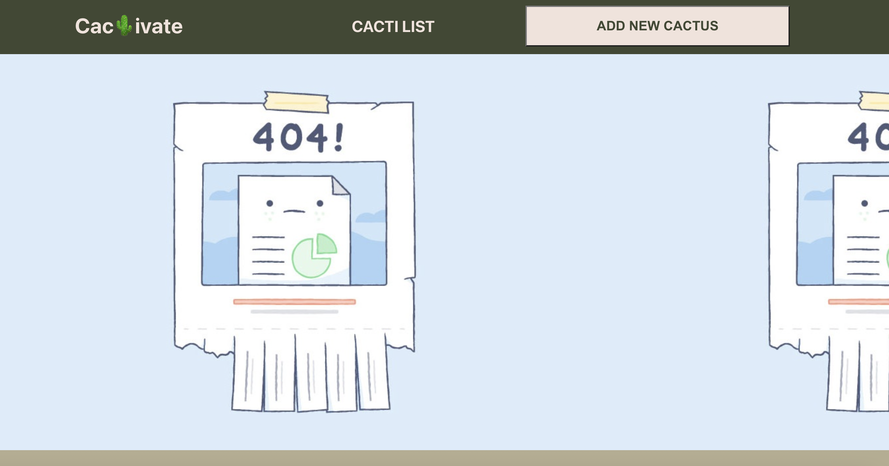
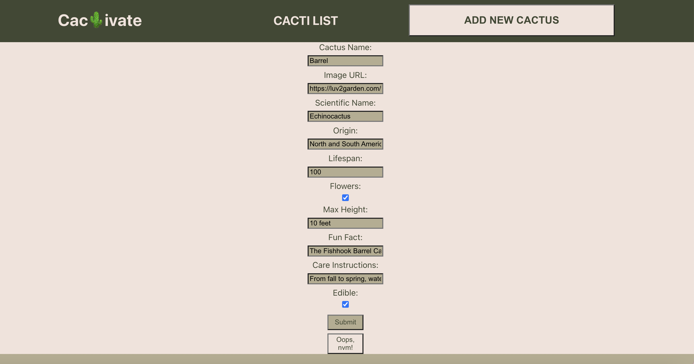

# [Cact🌵vate](http://localhost:3000/)

# [BACKEND REPO](https://github.com/arerimr/cactivate-backend)

#### [CLICK HERE](http://localhost:3000/) to view site!

## About
Full stack web application where user can view all cacti, or a single cactus, update, create or delete a single cactus. This application was created as part of the pursuit curriculum for educational purposes.

 

 

## Index Page
A list of cacti will be shown

* **Hover** over a cactus
* **Click once** to view full cactus details

 

## Show Page

 

## 404 Page

 

## Search and New Form

 

### Languages

⌨ JAVASCRIPT: EXPRESS.JS, REACT.JS

🍩 SQL

💻 HTML

🎨 CSS